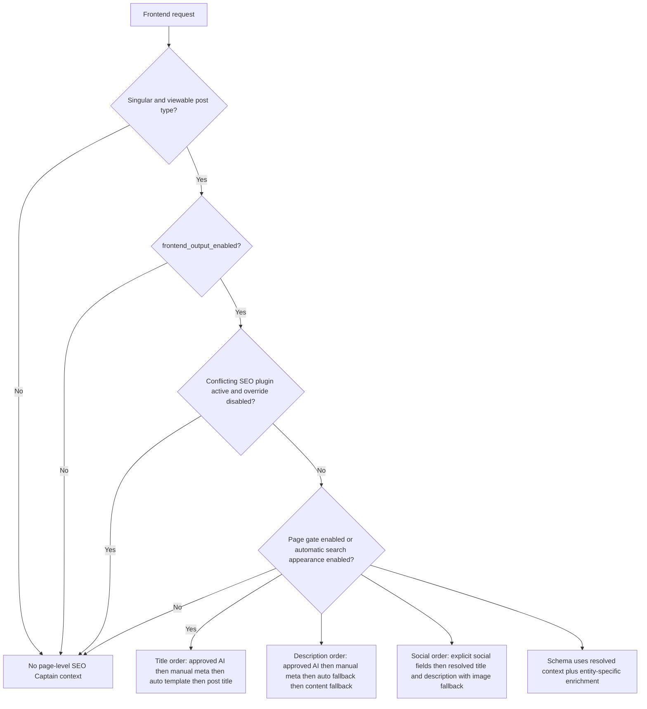

# SEO Captain Project Handoff

Snapshot date: 2026-05-14

Plugin root: `wp-content/plugins/ai-seo-captain`

Plugin version header: `1.3.1`

Purpose: this is the fast-start handoff document for any new chat session. Read this together with `PLAN.md` before making new changes.

## One-paragraph brief

SEO Captain is a hybrid AI plus deterministic SEO plugin for WordPress. It is the main standalone SEO layer for this site — not a helper beside another SEO plugin. Deterministic code owns the live frontend behavior, schema, discovery documents, sitemaps, audits, and signaling. AI is used for drafting metadata, answering editor questions, site-wide strategic audits, and the AI Strategist chat. The plugin covers both singular and non-singular content with configurable search appearance, XML sitemaps, and full frontend SEO output. A scale-aware Runs system allows large sites to work in manageable batches.

## Current mission

- Replace the practical day-to-day need for another free SEO plugin on this site.
- Keep the plugin useful even when no AI suggestion has been approved yet.
- Prefer standalone frontend behavior over migration convenience.
- Keep AI as an assistant and drafter, not the only route to usable SEO output.
- Support scale-aware workflows for sites of any size via the Runs system.

## What is shipped today

- Plugin bootstrap, service wiring, activation, uninstall cleanup, PSR-4 autoloader, and namespaced runtime.
- **Modular admin architecture**: slim `class-admin.php` coordinator delegating to `class-admin-ajax.php` (AJAX handlers), `class-admin-rollout.php` (sync/submit/audit actions), `class-admin-import-export.php` (export, import, Yoast migration), `class-admin-taxonomy.php` (taxonomy SEO fields), and `class-seo-analysis.php` (deterministic SEO checks).
- Settings page with provider, model, API key, system prompt, feature flags, frontend toggles, search appearance controls, Google/Bing verification fields, and IndexNow controls (107 UI controls audited and verified).
- **Setup Wizard** with 3-step guided flow: Index → Generate → Audit. Includes cost/time warning modal (always shown), pause/resume/stop controls, WooCommerce Products filter, skip rules, runs system, and "View Full Page List" link to Bulk Editor.
- Content indexing into dedicated SQL tables for inventory, audits, and AI context.
- Page-level editor metabox with snippet analysis, readability and SEO checks, social previews, schema and advanced fields, AI drafting, approval, history, and chat.
- **Gutenberg sidebar panel** with dedicated JS and CSS assets.
- Audit dashboard with readiness scoring, duplicate detection, thin-content reporting, rollout candidate views, site-audit generation, collapsible history sections with load-more and export buttons.
- **AI SEO Strategist** — dedicated site-wide AI chat page with focus-page scoping, run awareness, capacity display, and persistent conversations.
- **Bulk SEO Editor** with row counter, real-time search filtering, WooCommerce-aware post type filter, inline AJAX save, and visual site structure tree.
- **Image SEO** dashboard with alt text management, inline editing, "Used on" toggle, filter by alt status.
- **Video SEO** dashboard with auto-detection of YouTube, Vimeo, and self-hosted videos (9 formats), inline SEO title/description editing, provider badges (color-coded), filters by source and description status, "Used on" column, thumbnail previews.
- **Document SEO** dashboard supporting PDF, Word, Excel, PowerPoint, OpenDocument, RTF, TXT with inline title/description editing, format icons, file size display, "Used on" tracking with expandable toggle, filters by format and title status.
- **Keyword Tracking** with cannibalization detection, coverage stats synced with content index, sortable table.
- Frontend output for title, meta description, canonical, robots, Open Graph, Twitter cards, schema, breadcrumb schema, visible breadcrumbs, and sitewide webmaster verification tags.
- Automatic search appearance baseline for public singular content when explicit metadata is missing.
- Non-singular search appearance for category, tag, author, date, search, home/posts page, post type archive, and 404 contexts with configurable title templates and per-context noindex controls.
- XML Sitemap engine with sitemap index at `/sitemap_index.xml`, per-type sitemaps, XSL stylesheet, robots.txt directive, WordPress core sitemap replacement, and noindex-aware filtering.
- AI discovery documents at `llms.txt` and `llms-full.txt`.
- IndexNow key serving, logging, manual submission, and auto-submit hooks.
- Non-destructive Yoast metadata import for migration without overwriting existing SEO Captain values.
- **Export/Import** — JSON export/import of settings, metadata, and redirects with selective checkboxes.
- Title branding system: automatic ` | Brand` suffix on page-specific SEO titles, configurable site brand setting, per-page opt-out, and AI prompt budget enforcement.
- AI generation context intelligence: live browser field overrides, preserve-if-good evaluation, keyphrase enforcement in both title and description, full tab data in AI prompts, and keyphrase write-back to editor.
- AI Content Editor with changeset-based editing, preview, apply/discard, backup/restore, and multi-builder support.- AI audit context includes per-page video embed counts and linked document counts for comprehensive media awareness.- **Redirects & 404 Monitor** with 301/302/307 redirect management, 404 error logging, hit counters, and AJAX-based add/delete.
- **Scale-aware Runs system**: saved named page lists, `completed_steps` tracking per run, create/delete runs via AJAX.
- **Skip Rules**: URL pattern matching to exclude pages from both metadata generation and full audits; server-side enforced in `handle_bulk_generate()`.
- **Data Management**: scope-based clearing (metadata, audits, everything) with confirmation modals; deletes 19 post meta keys + 4 term meta keys + conversations + messages + IndexNow log + runs + active_runs user meta.
- **WooCommerce integration**: automatic detection, product-aware filtering in wizard modal, bulk editor, and site structure tree.
- **Incremental Content Index**: real-time index updates via `save_post`, `delete_post`, `trashed_post`, `untrashed_post` hooks — no manual re-index needed for day-to-day changes. Full re-index still available.
- **IndexNow deletion awareness**: notifies search engines via `before_delete_post` and `trashed_post` hooks when published content is removed.
- **Exclude from Sitemap**: per-page checkbox in the editor Advanced tab, independent from robots directives (noindex). Stored as `_ai_seo_captain_exclude_sitemap` meta.
- **Scheduled Tasks Manager**: three cron jobs (Index Health, Stale Cleanup, Sitemap Ping) with dedicated admin page showing status, controls (Pause/Resume/Run Now), and execution log.
- **Automated test suite**: 81 PHPUnit tests, 141 assertions, all passing.
- GreenCoders design identity in the editor metabox with promoted accordion style, branded button styles, and custom help-tip iconography.

## What is not finished yet

- AI site-structure assistant: dedicated admin page where AI can view the full sitemap, propose URL restructuring, rename slugs, and manage redirects.
- Broader schema enrichment from trusted site-specific data sources such as product price, SKU, and organization/contact details where available.
- AI-powered alt text generation for images from page context and image analysis.
- RankMath and SEOPress import wizards (currently only Yoast is supported).

## Architecture graph

```mermaid
flowchart TD
    WP[WordPress boot] --> Bootstrap[ai-seo-captain.php]
    Bootstrap --> Autoload[autoload.php PSR-4]
    Bootstrap --> Activator[class-activator.php]
    Bootstrap --> Plugin[class-plugin.php]

    Plugin --> Settings[class-settings.php]
    Plugin --> History[class-history-store.php]
    Plugin --> IndexNow[class-indexnow.php]
    Plugin --> Discovery[class-discovery.php]
    Plugin --> RunManager[class-run-manager.php]
    Plugin --> SiteChat[class-site-chat.php]

    Plugin -->|is_admin()| Indexer[class-content-indexer.php]
    Plugin -->|is_admin()| AIGenerator[class-ai-generator.php]
    Plugin -->|is_admin()| Admin[class-admin.php slim coordinator]
    Admin --> AdminAjax[class-admin-ajax.php]
    Admin --> AdminRollout[class-admin-rollout.php]
    Admin --> AdminImportExport[class-admin-import-export.php]
    Admin --> AdminTaxonomy[class-admin-taxonomy.php]
    Admin --> SEOAnalysis[class-seo-analysis.php]
    Admin --> Audit[class-audit-engine.php]

    Plugin -->|public frontend| Frontend[class-frontend.php]
    Plugin --> Sitemap[class-sitemap.php]
    Plugin --> Redirects[class-redirects.php]
    Plugin --> WooCommerce[class-woocommerce-integration.php]

    Settings --> Options[(wp_options)]
    Indexer --> ContentIndex[(ai_seo_captain_content_index)]
    History --> Conversations[(ai_seo_captain_conversations)]
    History --> Messages[(ai_seo_captain_messages)]
    RunManager --> Runs[(ai_seo_captain_runs)]
    Redirects --> RedirectsTable[(ai_seo_captain_redirects)]
    Admin --> PostMeta[(wp_postmeta)]
    Frontend --> PostMeta

    Frontend --> HeadOutput[document title and wp_head output]
    Discovery --> DiscoveryDocs[llms.txt and llms-full.txt]
    IndexNow --> KeyEndpoint[IndexNow key endpoint]
```

## Frontend decision graph



## File map

| File | Responsibility |
| --- | --- |
| `ai-seo-captain.php` | Bootstrap, constants, autoloader trigger, activation hook, DB auto-upgrade, boot entrypoint |
| `includes/autoload.php` | PSR-4 autoloader for `AI_SEO_Captain` namespace |
| `includes/class-plugin.php` | Runtime composition and admin/frontend boot split |
| `includes/class-activator.php` | SQL table creation (5 tables), default option initialization, `completed_steps` column |
| `includes/class-settings.php` | Settings defaults, registration, sanitization, title branding helpers |
| `includes/class-admin.php` | Slim coordinator: menu registration, asset enqueuing, editor metabox, delegation to sub-modules |
| `includes/admin/class-admin-ajax.php` | All AJAX handlers (generate, chat, approve, bulk save, image alt, setup, skip, runs, clear data) |
| `includes/admin/class-admin-rollout.php` | Sync index, submit IndexNow, generate site audit, bulk frontend rollout |
| `includes/admin/class-admin-import-export.php` | Export/import settings+metadata (JSON), Yoast migration |
| `includes/admin/class-admin-taxonomy.php` | Taxonomy term SEO fields (render + save) |
| `includes/admin/class-seo-analysis.php` | Deterministic SEO checks: keyphrase density, readability, link analysis, content structure |
| `includes/class-content-indexer.php` | Content inventory, audit summary SQL, readiness counts, `get_all_indexed_pages()` |
| `includes/class-audit-engine.php` | Higher-level audit report assembly for admin |
| `includes/class-ai-generator.php` | Provider calls, prompt building with live context overrides and preserve-if-good logic, AI response parsing |
| `includes/class-history-store.php` | Conversation storage, suggestion history, approvals, site audit history |
| `includes/class-content-writer.php` | Pending content changes workflow (changeset pattern) |
| `includes/class-content-helper.php` | Content extraction helper for AI prompts |
| `includes/class-meta-keys.php` | Centralized post/term meta key constants |
| `includes/class-run-manager.php` | Runs CRUD, `mark_step_complete()`, `has_completed_step()`, `get_indexed_pages_for_selector()` |
| `includes/class-site-chat.php` | AI Strategist chat handler (send, clear, focus pages) |
| `includes/class-frontend.php` | Document title with branding suffix, head tags, schema, breadcrumbs, automatic search appearance for singular and non-singular contexts, verification tags |
| `includes/class-sitemap.php` | XML Sitemap index, per-type sitemaps, XSL stylesheet, robots.txt directive, WordPress core sitemap replacement |
| `includes/class-redirects.php` | 301/302/307 redirect manager, 404 logging, hit counter |
| `includes/class-discovery.php` | `llms.txt` and `llms-full.txt` generation |
| `includes/class-indexnow.php` | IndexNow key file handling, submissions, log storage |
| `includes/class-woocommerce-integration.php` | WooCommerce detection and product-aware features |
| `uninstall.php` | Drops plugin tables, deletes options, removes all post/term meta keys, cleans user meta |

## Storage model

### Options

- Option name: `ai_seo_captain_options`
- IndexNow log option: `ai_seo_captain_indexnow_log`
- DB version option: `ai_seo_captain_db_version`

### SQL tables

- `wp_ai_seo_captain_content_index`
  - Site inventory used for audits and AI context.
- `wp_ai_seo_captain_conversations`
  - Conversation containers for per-post chat, site-chat, and site-audit sessions.
- `wp_ai_seo_captain_messages`
  - Stored user and assistant messages, including AI suggestion payloads.
- `wp_ai_seo_captain_redirects`
  - Redirect rules (source, target, type, hits, created_at).
- `wp_ai_seo_captain_runs`
  - Saved page lists for batch processing (name, page_ids, page_count, model_used, status, completed_steps).

### Important post meta keys

- `_ai_seo_captain_meta_title`
- `_ai_seo_captain_meta_description`
- `_ai_seo_captain_focus_keyphrase`
- `_ai_seo_captain_social_title`
- `_ai_seo_captain_social_description`
- `_ai_seo_captain_social_image`
- `_ai_seo_captain_canonical_url`
- `_ai_seo_captain_robots_directives`
- `_ai_seo_captain_schema_type`
- `_ai_seo_captain_approved_message_id`
- `_ai_seo_captain_frontend_enabled`
- `_ai_seo_captain_page_audit`
- `_ai_seo_captain_audit_skip`
- `_ai_seo_captain_pending_content_changes`
- `_ai_seo_captain_content_backup`
- `_ai_seo_captain_cornerstone`
- `_ai_seo_captain_title_branding_off`
- `_ai_seo_captain_hreflang`

### Term meta keys

- `_ai_seo_captain_term_title`
- `_ai_seo_captain_term_description`
- `_ai_seo_captain_term_canonical`
- `_ai_seo_captain_term_noindex`

## Runtime flow

### 1. Boot flow

1. WordPress loads `ai-seo-captain.php`.
2. Activation creates the content index, conversations, and messages tables.
3. `Plugin::boot()` instantiates shared services.
4. In admin, the plugin boots the content indexer, AI generator, and admin UI.
5. On the public site, the plugin boots the frontend SEO output engine.

### 2. Editor flow

1. `class-admin.php` registers the metabox for public post types except attachments.
2. The operator can save manual SEO fields, request AI suggestions, approve a suggestion, or chat with the page assistant.
3. AI requests are built by `class-ai-generator.php` using the current post plus indexed site context. When called from the editor, live browser field values override stale database values. The AI evaluates existing drafts before rewriting and enforces keyphrase presence in titles and descriptions.
4. Requests and responses are stored by `class-history-store.php`.
5. Approved suggestions and saved manual fields become eligible frontend inputs.

### 3. Frontend flow

1. `class-frontend.php` checks whether global frontend output is enabled.
2. It suppresses output if another SEO plugin is active and conflict override is disabled.
3. It allows output when either the page gate is enabled or automatic search appearance is enabled.
4. It resolves metadata in this order:
   - approved AI suggestion
   - saved manual metadata
   - automatic search appearance defaults
5. It emits title, meta description, canonical, robots, Open Graph, Twitter, schema, breadcrumbs, and verification tags from one resolved context.

### 4. Audit and rollout flow

1. `class-content-indexer.php` scans public content into the inventory table.
2. `class-audit-engine.php` builds readiness metrics from the index plus post meta.
3. The admin audit page surfaces missing drafts, duplicate titles, thin content, rollout candidates, and site audit actions.
4. Bulk frontend rollout can enable page-level output for content that already has approved or saved frontend-ready metadata.

### 5. Discovery and signaling flow

1. `class-discovery.php` serves `llms.txt` and `llms-full.txt` directly on request.
2. The full document can include the latest stored AI site audit summary.
3. `class-indexnow.php` serves the verification key file, handles auto-submit on save, and logs manual or automatic submissions.
4. On localhost, IndexNow behavior is intentionally safe and does not act like live production refresh signaling.

## Key behavioral rules

- Manual page metadata is a valid production path. The plugin is not dependent on AI approval for every page.
- Approved AI suggestions still win over manual metadata when both exist for the same field.
- Automatic search appearance is a fallback layer, not a replacement for strong page-specific metadata.
- Visible breadcrumbs and breadcrumb schema now use the same underlying trail logic.
- Verification tags are sitewide and controlled from settings, not per page.
- Discovery documents are separate from the HTML head output and can remain useful even when another SEO plugin controls the frontend head.

## Operator and environment notes

- Workspace root: `c:/xampp/htdocs/greencoders`
- Plugin root: `c:/xampp/htdocs/greencoders/wp-content/plugins/ai-seo-captain`
- Environment: local WordPress under XAMPP on Windows
- PHP executable: `c:/xampp/php/php.exe`
- Git repository: `https://github.com/VladStef-GC/AISEO.git` (branch `main`)
- PSR-4 autoloader: `includes/autoload.php` (`AI_SEO_Captain\ClassName` → `includes/class-classname.php`)
- Admin JS/CSS auto-loading: create `assets/js/page-{slug}.js` or `assets/css/page-{slug}.css` — no code changes needed.
- Uninstall performs hard cleanup: all 5 plugin tables, all options, all post/term meta keys, user meta.

## Validation patterns that have been used successfully

- `php -l` against changed PHP files.
- `php -d extension=php_zip.dll vendor/bin/phpunit --testsuite Unit` for automated tests (81 tests, 141 assertions).
- WordPress runtime probes via `wp-load.php` with direct class instantiation and buffered HTML/head output checks.
- Admin render checks that include `wp-admin/includes/template.php` when needed.
- SQL checks for readiness counts when UI sampling is capped.
- Full UI audit across all 9 admin pages verifying every control has a working backend handler.

## Current priorities for the next session

1. AI site-structure assistant: dedicated admin page where AI can view the full sitemap, propose URL restructuring, rename slugs, and manage redirects.
2. AI-powered image alt text generation from page context and image analysis.
3. RankMath and SEOPress import wizards.
4. Broader schema enrichment from trusted site-specific data sources.

## New chat briefing

Use this as the starting brief for a new chat:

```text
Read wp-content/plugins/ai-seo-captain/PLAN.md and wp-content/plugins/ai-seo-captain/PROJECT-HANDOFF.md first.

We are building SEO Captain (v1.3.1) as a standalone WordPress SEO plugin that replaces the need for another free SEO plugin.

Current state:
- Full standalone SEO layer for both singular and non-singular content
- Modular admin architecture (slim class-admin.php + 5 sub-modules)
- Scale-aware Runs system for large sites
- AI Strategist (site-wide chat), per-page AI chat, AI content editor
- Setup Wizard with cost/time warnings, skip rules, WooCommerce awareness
- Bulk Editor with search, row counter, site structure tree
- 81 PHPUnit tests passing
- All 9 admin pages audited: 0 orphaned controls

Working rule:
Prioritize standalone frontend behavior. Module changes go in /modules/ or existing admin sub-classes.
```